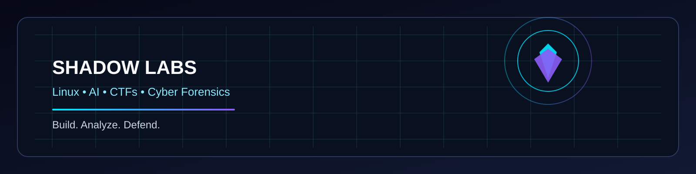

  <picture>
    <source media="(prefers-color-scheme: dark)" srcset="./assets/dark.svg">
    <source media="(prefers-color-scheme: light)" srcset="./assets/light.svg">
    
  </picture>

<h1 align="center">Hello, I'm YOUR_USERNAME 👋</h1>

  Cybersecurity enthusiast • Linux tinkerer • CTF player • AI automation builder

## About me

I am focused on building practical security tooling, exploring Linux internals, and turning ideas into resilient systems. My interests span:

- Shadow Linux
- Shadow AI
- CTFs and red team workflows
- Cyber forensics and threat analysis
- Automation and developer tooling

## GitHub stats

  
  

  

## Activity

  

## Connect

- GitHub: YOUR_USERNAME
- Email: you@example.com
