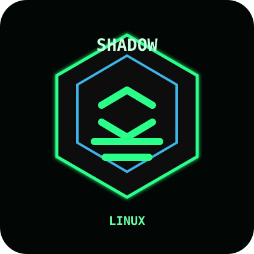
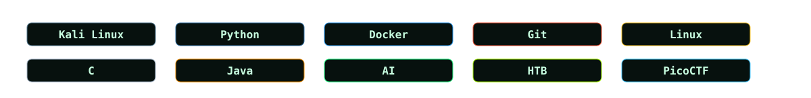

<!-- SHADOW TERMINAL PROFILE: generated by generate.js. Edit config/profile.json, then run npm run build. -->

<p align="center">
  
</p>

<p align="center">
  <a href="https://github.com/jackdaniels23-ar?tab=repositories"></a>
  <a href="https://github.com/jackdaniels23-ar?tab=followers"></a>
  
  
  
</p>

<a id="release"></a>

## root@shadowlinux:~$ release --version

| Version | Change |
| --- | --- |
| v1.0.0 | Shadow Terminal profile release |
| v1.5 | Boot animation, quote rotation, timeline, badges |
| v2.0 | Dedicated Shadow Terminal portfolio site |

<a id="whoami"></a>

## root@shadowlinux:~$ whoami

```txt
root@shadowlinux:~$ whoami
jackdaniels23-ar

root@shadowlinux:~$ cat about.txt
Cyber Forensics Student
AI Developer
Ethical Hacker
Shadow Linux Creator
```

<p align="center">
  
</p>

<picture>
  <source media="(prefers-color-scheme: dark)" srcset="./assets/dark.svg">
  <source media="(prefers-color-scheme: light)" srcset="./assets/light.svg">
  
</picture>

<p align="center">
  
</p>

<p align="center">
  
</p>

<a id="stats"></a>

## root@shadowlinux:~$ stats --live

<p align="center">
  
  
</p>

<p align="center">
  
</p>

<p align="center">
  
</p>

<p align="center">
  
</p>

<a id="snake"></a>

## root@shadowlinux:~$ snake --green

<p align="center">
  <picture>
    <source media="(prefers-color-scheme: dark)" srcset="https://raw.githubusercontent.com/jackdaniels23-ar/jackdaniels23-ar/output/github-contribution-grid-snake-dark.svg">
    <source media="(prefers-color-scheme: light)" srcset="https://raw.githubusercontent.com/jackdaniels23-ar/jackdaniels23-ar/output/github-contribution-grid-snake.svg">
    
  </picture>
</p>

<a id="matrix"></a>

## root@shadowlinux:~$ matrix --rain

<p align="center">
  
</p>

<a id="skills"></a>

## root@shadowlinux:~$ skills


<p align="center">
  
</p>

| Signal | Source |
| --- | --- |
| Repositories | Live via GitHub stats |
| Languages | Python, C, Java, JavaScript, HTML, CSS |
| Projects | Shadow Linux, Shadow AI, Toolkit, Resume Analyzer |
| CTFs | HTB, PicoCTF, TryHackMe |
| Commits | Live via GitHub stats |
| Stars | Live via GitHub trophies |
| Followers | Live via GitHub badge |

<a id="timeline"></a>

## root@shadowlinux:~$ timeline

| Year | Milestone |
| --- | --- |
| 2024 | Started Cyber Security |
| 2025 | Hack The Box |
| 2026 | Shadow Linux |
| 2027 | Shadow AI |

<a id="projects"></a>

## root@shadowlinux:~$ projects

| Project | Signal |
| --- | --- |
| [Shadow Linux](https://github.com/jackdaniels23-ar) | A cyber-focused Linux concept with defensive tooling, terminal workflows, and AI-assisted operations. |
| [Shadow AI](https://github.com/jackdaniels23-ar) | Local-first AI agent experiments for security automation, triage, and productivity. |
| [Python Security Toolkit](https://github.com/jackdaniels23-ar) | Python utilities for scanning, parsing, forensic triage, and repeatable security checks. |
| [Resume Analyzer](https://github.com/jackdaniels23-ar) | AI-powered resume scoring and feedback for cleaner, targeted job applications. |
| [HTB Writeups](https://github.com/jackdaniels23-ar) | Forensics, web, crypto, and reverse engineering notes from hands-on challenges. |

<a id="terminal"></a>

## root@shadowlinux:~$ help

<a href="#terminal"><code>help</code></a> | <a href="#whoami"><code>whoami</code></a> | <a href="#skills"><code>skills</code></a> | <a href="#projects"><code>projects</code></a> | <a href="#contact"><code>contact</code></a>

```txt
root@shadowlinux:~$ whoami
jackdaniels23-ar

root@shadowlinux:~$ cat skills.txt
Repositories | Languages | Projects | CTFs | Commits | Stars | Followers

Booting Shadow Linux...
Loading Kernel...
Initializing AI...
Loading Modules...
READY

Shadow AI >
Ask me anything...
```

<a id="ctf"></a>

## root@shadowlinux:~$ ctf --status

| Platform | Rank | Machines / Rooms | Season / Points |
| --- | --- | --- | --- |
| [HackTheBox](https://app.hackthebox.com/profile/overview) | Add real rank | Add machines + Sherlocks | Add season progress |
| [PicoCTF](https://play.picoctf.org/users) | Add real rank | Add solved challenges | Add points |
| [TryHackMe](https://tryhackme.com/p/jackdaniels23-ar) | Add real rank | Add rooms + badges | Add streak |

Update real CTF progress in `config/profile.json`, then run `npm run build`.

<a id="contact"></a>

## root@shadowlinux:~$ contact

<p>
  <a href="https://github.com/jackdaniels23-ar"></a>
  <a href="https://shadowlinux.dev"></a>
</p>
